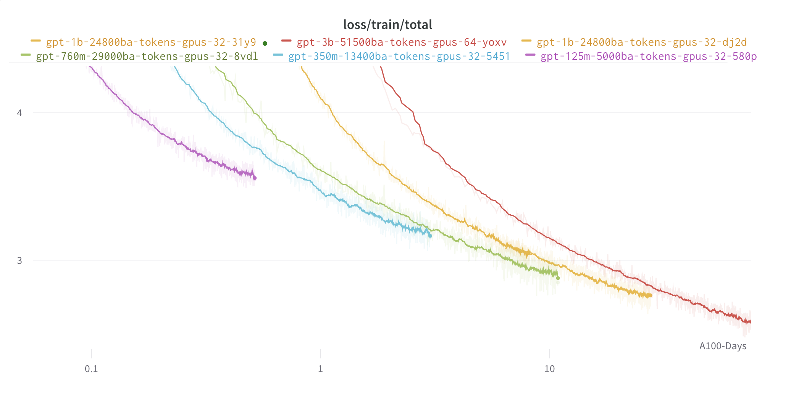

# MosaicML Examples

This repo contains reference examples for training ML models quickly and to high accuracy. It's designed to be easily forked and modified.

It currently features the following examples:

* [ResNet-50 + ImageNet](#resnet-50--imagenet)
* [DeeplabV3 + ADE20k](#deeplabv3--ade20k)
* [GPT / Large Language Models](#large-language-models-llms)
* [BERT](#bert)

## Installation

To get started, either clone or fork this repo and install whichever example\[s\] you're interested in. E.g., to get started training GPT-style Large Language Models, just:

```bash
git clone https://github.com/mosaicml/examples.git
cd examples # cd into the repo
pip install -e ".[llm]"  # or pip install -e ".[llm-cpu]" if no NVIDIA GPU
cd examples/llm # cd into the specific example's folder
```

Available examples include `llm`, `stable-diffusion`, `resnet-imagenet`, `resnet-cifar`, `bert`, `deeplab`, `nemo`, and `gpt-neox`.

## Extending an example

Each example provides a short `main.py` that constructs a `Trainer` object and all of the arguments to it. There are three easy ways to extend an example:

1. **Change the configuration.** Each example has a `yamls` subdirectory, and each `yaml` file therein contains settings like the learning rate, where to load data from, and more. These settings are read within `main.py` and used to configure the `Trainer`.
1. **Modify the arguments to `Trainer` directly.**  For example, if you want to use a different optimizer, the simplest way is to construct this optimizer in `main.py` and pass it as the `optimizer` argument to the `Trainer`.
1. **Write an [Algorithm](https://docs.mosaicml.com/en/stable/trainer/algorithms.html#two-way-callbacks) and add it to the `Trainer`'s `algorithms` argument.** This lets you inject arbitrary code almost anywhere in your training loop and modify training as it happens. Composer includes [a big list](https://docs.mosaicml.com/en/stable/trainer/algorithms.html#robot-algorithms) of Algorithms whose [source code](https://github.com/mosaicml/composer/tree/dev/composer/algorithms) you can use as examples.

We also provide some convenient string-to-object mappings in [common/builders.py](./examples/common/builders.py). These let you avoid cluttering `main.py` with code like:

```python
if cfg.optimizer == 'adam':
   ...
elif cfg.optimizer == 'sgd':
  ...
```

and instead write:

```python
opt = builders.build_optimizer(cfg.optimizer, model)
```

with all the if-elif logic wrapped in this reusable function. You can easily extend these functions to include new options; e.g., to add an optimizer, you could extend [`build_optimizer`](./examples/common/builders.py) to import and construct your optimizer.

If you run into any issues extending the code, or just want to discuss an idea you have, please open an [issue](https://github.com/mosaicml/examples/issues/new) or join our [community Slack](https://join.slack.com/t/mosaicml-community/shared_invite/zt-1btms90mc-GipE2ufuPkKY0QBrmF3LSA)!

## Tests and Linting

If you already have the dependencies for a given example installed, you can just run:
```bash
pre-commit run --all-files  # autoformatting for whole repo
cd examples/llm  # or bert, resnet_imagenet, etc
pyright .  # type checking
pytest tests/  # run tests
```
from the example's directory.

To run the full suite of tests for all examples, invoke `make test` in the project's root directory. Similarly, invoke `make lint` to autoformat your code and detect type issues throughout the whole codebase. This is much slower than linting or testing just one example because it installs all the dependencies for each example from scratch in a fresh virtual environment.

## Overriding Arguments
These examples use [`OmegaConf`](https://github.com/omry/omegaconf) to manage configuration. OmegaConf allows us to make configuration explicit via separate YAML files while also allowing rapid experimentation and easy command line override. There's no special language or format for these configurations; they're just a convenient way of writing out a dictionary that gets used in each `main.py` file.

Here's a simple example. Let's say you have this YAML config file:
```yaml
a: 1
nested:
    foo: bar
```
and we run:
```bash
python script.py b=baz nested.foo=different
```
The `main.py` file will end up with:
```python
{'a': 1, 'b': 'baz', 'nested': {'foo': 'different'}}
```

# Examples

This repo features the following examples, each as their own subdirectory:

## ResNet-50 + ImageNet


*Figure 1: Comparison of MosaicML recipes against other results, all measured on 8x A100s on the MosaicML platform.*

Train the [MosaicML ResNet](https://www.mosaicml.com/blog/mosaic-resnet), which is currently the [fastest ResNet50 implementation there is](https://www.mosaicml.com/blog/mlperf-2022) and yields a :sparkles: 7x :sparkles: faster time-to-train than a strong baseline.

:rocket: Get started with the code [here](./examples/resnet_imagenet/).


## DeepLabV3 + ADE20k


Train the [MosaicML DeepLabV3](https://www.mosaicml.com/blog/mosaic-image-segmentation), which yields a :sparkles:5x:sparkles: faster time-to-train than a strong baseline.

:rocket: Get started with the code [here](./examples/deeplab/).


## Large Language Models (LLMs)

<picture>
  <source media="(prefers-color-scheme: dark)" srcset="./examples/llm/assets/loss-curve-dark.png">
  
</picture>

A simple yet feature-complete implementation of GPT, which scales to 70B parameters while maintaining high performance on GPU clusters. Flexible code, written with vanilla PyTorch, that uses [PyTorch FSDP](https://pytorch.org/blog/introducing-pytorch-fully-sharded-data-parallel-api/) and some recent efficiency improvements.

:rocket: Get started with the code [here](./examples/llm/).


## BERT

This benchmark covers both pre-training and fine-tuning a BERT model. With this starter code, you'll be able to do Masked Language Modeling (MLM) pre-training on the C4 dataset and classification fine-tuning on GLUE benchmark tasks.

We also provide the source code and recipe behind our Mosaic BERT model, which you can train yourself using this repo.

:rocket: Get started with the code [here](./examples/bert/).
