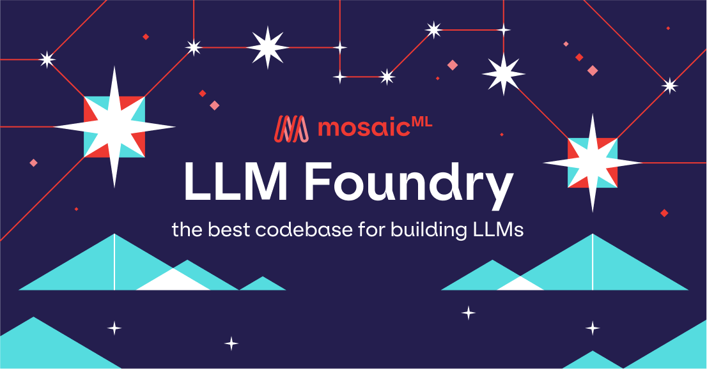

<!-- SETUPTOOLS_LONG_DESCRIPTION_HIDE_BEGIN -->
<p align="center">
  <a href="https://github.com/mosaicml/llm-foundry">
    <picture>
      
    </picture>
  </a>
</p>
<!-- SETUPTOOLS_LONG_DESCRIPTION_HIDE_END -->

<p align="center">
    <a href="https://pypi.org/project/llm-foundry/">
        
    </a>
    <a href="https://pypi.org/project/llm-foundry/">
        
    </a>
    <a href="https://mosaicml.me/slack">
        
    </a>
    <a href="https://github.com/mosaicml/llm-foundry/blob/main/LICENSE">
        
    </a>
</p>
<br />

# LLM Foundry

This repository contains code for training, finetuning, evaluating, and deploying LLMs for inference with [Composer](https://github.com/mosaicml/composer) and the [MosaicML platform](https://forms.mosaicml.com/demo?utm_source=github.com&utm_medium=referral&utm_campaign=llm-foundry). Designed to be easy-to-use, efficient _and_ flexible, this codebase enables rapid experimentation with the latest techniques.

You'll find in this repo:
* `llmfoundry/` - source code for models, datasets, callbacks, utilities, etc.
* `scripts/` - scripts to run LLM workloads
  * `data_prep/` - convert text data from original sources to StreamingDataset format
  * `train/` - train or finetune HuggingFace and MPT models from 125M - 70B parameters
    * `train/benchmarking` - profile training throughput and MFU
  * `inference/` - convert models to HuggingFace or ONNX format, and generate responses
    * `inference/benchmarking` - profile inference latency and throughput
  * `eval/` - evaluate LLMs on academic (or custom) in-context-learning tasks
* `mcli/` - launch any of these workloads using [MCLI](https://docs.mosaicml.com/projects/mcli/en/latest/) and the [MosaicML platform](https://www.mosaicml.com/platform)
* `TUTORIAL.md` - a deeper dive into the repo, example workflows, and FAQs

# DBRX

DBRX is a state-of-the-art open source LLM trained by Databricks Mosaic team. It uses the Mixture-of-Experts (MoE) architecture and was trained with optimized versions of [Composer](https://github.com/mosaicml/composer), LLM Foundry, and [MegaBlocks](https://github.com/databricks/megablocks). The model has 132B total parameters and 36B active parameters. We have released two DBRX models:


| Model              | Context Length | Download                                           |
| ------------------ | -------------- | -------------------------------------------------- |
| DBRX Base          | 32768          | https://huggingface.co/databricks/dbrx-base        |
| DBRX Instruct      | 32768          | https://huggingface.co/databricks/dbrx-instruct    |

Our model weights and code are licensed for both researchers and commercial entities. The Databricks Open Source License can be found at [LICENSE](https://github.com/databricks/dbrx/LICENSE), and our Acceptable Use Policy can be found [here](https://www.databricks.com/legal/acceptable-use-policy-open-model).

For more information about the DBRX models, see https://github.com/databricks/dbrx.

# MPT

Mosaic Pretrained Transformers (MPT) are GPT-style models with some special features -- Flash Attention for efficiency, ALiBi for context length extrapolation, and stability improvements to mitigate loss spikes. As part of MosaicML's Foundation series, we have open-sourced several MPT models:


| Model              | Context Length | Download                                           | Commercial use? |
| ------------------ | -------------- | -------------------------------------------------- | --------------- |
| MPT-30B            | 8192           | https://huggingface.co/mosaicml/mpt-30b            | Yes             |
| MPT-30B-Instruct   | 8192           | https://huggingface.co/mosaicml/mpt-30b-instruct   | Yes             |
| MPT-30B-Chat       | 8192           | https://huggingface.co/mosaicml/mpt-30b-chat       | No              |
| MPT-7b-8k          | 8192           | https://huggingface.co/mosaicml/mpt-7b-8k          | Yes             |
| MPT-7b-8k-Chat | 8192           | https://huggingface.co/mosaicml/mpt-7b-8k-chat         | No              |
| MPT-7B             | 2048           | https://huggingface.co/mosaicml/mpt-7b             | Yes             |
| MPT-7B-Instruct    | 2048           | https://huggingface.co/mosaicml/mpt-7b-instruct    | Yes             |
| MPT-7B-Chat        | 2048           | https://huggingface.co/mosaicml/mpt-7b-chat        | No              |
| MPT-7B-StoryWriter | 65536          | https://huggingface.co/mosaicml/mpt-7b-storywriter | Yes             |

To try out these models locally, [follow the instructions](https://github.com/mosaicml/llm-foundry/tree/main/scripts/inference#interactive-generation-with-modelgenerate) in `scripts/inference/README.md` to prompt HF models using our [hf_generate.py](https://github.com/mosaicml/llm-foundry/blob/main/scripts/inference/hf_generate.py) or [hf_chat.py](https://github.com/mosaicml/llm-foundry/blob/main/scripts/inference/hf_chat.py) scripts.

# MPT Community

We've been overwhelmed by all the amazing work the community has put into MPT! Here we provide a few links to some of them:
* [ReplitLM](https://github.com/replit/replitLM): `replit-code-v1-3b` is a 2.7B Causal Language Model focused on Code Completion. The model has been trained on a subset of the Stack Dedup v1.2 dataset covering 20 languages such as Java, Python, and C++
* [LLaVa-MPT](https://github.com/haotian-liu/LLaVA#LLaVA-MPT-7b): Visual instruction tuning to get MPT multimodal capabilities
* [ggml](https://github.com/ggerganov/ggml/tree/master): Optimized MPT version for efficient inference on consumer hardware
* [GPT4All](https://gpt4all.io/index.html): locally running chat system, now with MPT support!
* [Q8MPT-Chat](https://huggingface.co/spaces/Intel/Q8-Chat): 8-bit optimized MPT for CPU by our friends at Intel

Tutorial videos from the community:
* [Using MPT-7B with Langchain](https://www.youtube.com/watch?v=DXpk9K7DgMo&t=3s) by [@jamesbriggs](https://www.youtube.com/@jamesbriggs)
* [MPT-7B StoryWriter Intro](https://www.youtube.com/watch?v=O9Y_ZdsuKWQ) by [AItrepreneur](https://www.youtube.com/@Aitrepreneur)
* [Fine-tuning MPT-7B on a single GPU](https://www.youtube.com/watch?v=KSlWkrByc0o&t=9s) by [@AIology2022](https://www.youtube.com/@AIology2022)
* [How to Fine-tune MPT-7B-Instruct on Google Colab](https://youtu.be/3de0Utr9XnI) by [@VRSEN](https://www.youtube.com/@vrsen)

Something missing? Contribute with a PR!

# Latest News
* [Blog: Introducing DBRX: A New State-of-the-Art Open LLM](https://www.databricks.com/blog/introducing-dbrx-new-state-art-open-llm)
* [Blog: LLM Training and Inference with Intel Gaudi2 AI Accelerators](https://www.databricks.com/blog/llm-training-and-inference-intel-gaudi2-ai-accelerators)
* [Blog: Training LLMs at Scale with AMD MI250 GPUs](https://www.databricks.com/blog/training-llms-scale-amd-mi250-gpus)
* [Blog: Training LLMs with AMD MI250 GPUs and MosaicML](https://www.mosaicml.com/blog/amd-mi250)
* [Blog: Announcing MPT-7B-8K: 8K Context Length for Document Understanding](https://www.mosaicml.com/blog/long-context-mpt-7b-8k)
* [Blog: Training LLMs with AMD MI250 GPUs and MosaicML](https://www.mosaicml.com/blog/amd-mi250)
* [Blog: MPT-30B: Raising the bar for open-source foundation models](https://www.mosaicml.com/blog/mpt-30b)
* [Blog: Introducing MPT-7B](https://www.mosaicml.com/blog/mpt-7b)
* [Blog: Benchmarking LLMs on H100](https://www.mosaicml.com/blog/coreweave-nvidia-h100-part-1)
* [Blog: Blazingly Fast LLM Evaluation](https://www.mosaicml.com/blog/llm-evaluation-for-icl)
* [Blog: GPT3 Quality for $500k](https://www.mosaicml.com/blog/gpt-3-quality-for-500k)
* [Blog: Billion parameter GPT training made easy](https://www.mosaicml.com/blog/billion-parameter-gpt-training-made-easy)


# Hardware and Software Requirements
This codebase has been tested with PyTorch 2.2 with NVIDIA A100s and H100s.
This codebase may also work on systems with other devices, such as consumer NVIDIA cards and AMD cards, but we are not actively testing these systems.
If you have success/failure using LLM Foundry on other systems, please let us know in a Github issue and we will update the support matrix!

| Device         | Torch Version | Cuda Version | Status                       |
| -------------- | ------------- | ------------ | ---------------------------- |
| A100-40GB/80GB | 2.3.1         | 12.1         | :white_check_mark: Supported |
| H100-80GB      | 2.3.1         | 12.1         | :white_check_mark: Supported |

## MosaicML Docker Images
We highly recommend using our prebuilt Docker images. You can find them here: https://hub.docker.com/orgs/mosaicml/repositories.

The `mosaicml/pytorch` images are pinned to specific PyTorch and CUDA versions, and are stable and rarely updated.

The `mosaicml/llm-foundry` images are built with new tags upon every commit to the `main` branch.
You can select a specific commit hash such as `mosaicml/llm-foundry:2.3.1_cu121-36ab1ba` or take the latest one using `mosaicml/llm-foundry:2.3.1_cu121-latest`.

**Please Note:** The `mosaicml/llm-foundry` images do not come with the `llm-foundry` package preinstalled, just the dependencies. You will still need to `pip install llm-foundry` either from PyPi or from source.

| Docker Image                                           | Torch Version | Cuda Version      | LLM Foundry dependencies installed? |
| ------------------------------------------------------ | ------------- | ----------------- | ----------------------------------- |
| `mosaicml/pytorch:2.3.1_cu121-python3.11-ubuntu20.04`  | 2.3.1         | 12.1 (Infiniband) | No                                  |
| `mosaicml/llm-foundry:2.3.1_cu121-latest`              | 2.3.1         | 12.1 (Infiniband) | Yes                                 |
| `mosaicml/llm-foundry:2.3.1_cu121_aws-latest`          | 2.3.1         | 12.1 (EFA)        | Yes                                 |


# Installation

This assumes you already have PyTorch, CMake, and packaging installed. If not, you can install them with `pip install cmake packaging torch`.

To get started, clone the repo and set up your environment. Instructions to do so differ slightly depending on whether you're using Docker.

### With Docker (recommended)

We *strongly* recommend working with LLM Foundry inside a Docker container (see our recommended Docker image above). If you are doing so, follow these steps to clone the repo and install the requirements.

<!--pytest.mark.skip-->
```bash
git clone https://github.com/mosaicml/llm-foundry.git
cd llm-foundry
pip install -e ".[gpu]"  # or `pip install -e .` if no NVIDIA GPU.
```

### Without Docker (not recommended)

If you choose not to use Docker, you should create and use a virtual environment.

<!--pytest.mark.skip-->
```bash
git clone https://github.com/mosaicml/llm-foundry.git
cd llm-foundry

# Creating and activate a virtual environment
python3 -m venv llmfoundry-venv
source llmfoundry-venv/bin/activate

pip install cmake packaging torch  # setup.py requires these be installed

pip install -e ".[gpu]"  # or `pip install -e .` if no NVIDIA GPU.
```

### TransformerEngine and amp_fp8 support
NVIDIA H100 GPUs have FP8 support; we have installed Flash Attention and Transformer in our Docker images already (see above). If you are not using our Docker images, you can install these packages with:
<!--pytest.mark.skip-->
```bash
pip install flash-attn --no-build-isolation
pip install git+https://github.com/NVIDIA/TransformerEngine.git@stable
```

See [here](https://github.com/mosaicml/llm-foundry/blob/main/TUTORIAL.md#TransformerEngine-and-amp_fp8-support) for more details on enabling TransformerEngine layers and amp_fp8.

### AMD (BETA support)

In [our testing of AMD GPUs](https://www.mosaicml.com/blog/amd-mi250), the env setup includes:

<!--pytest.mark.skip-->
```bash
git clone https://github.com/mosaicml/llm-foundry.git
cd llm-foundry

# Creating and activate a virtual environment
python3 -m venv llmfoundry-venv-amd
source llmfoundry-venv-amd/bin/activate

# installs
pip install cmake packaging torch
pip install -e .  # This installs some things that are not needed but they don't hurt
pip3 install torch torchvision torchaudio --index-url https://download.pytorch.org/whl/rocm5.4.2
```
**Lastly**, install the ROCm enabled flash attention (instructions [here](https://github.com/ROCmSoftwarePlatform/flash-attention/tree/flash_attention_for_rocm2#amd-gpurocm-support)).

Notes:
1. We don't yet have a Docker image where everything works perfectly. You might need to up/downgrade some packages (in our case, we needed to downgrade to `numpy==1.23.5`) before everything works without issue.

### Intel Gaudi
Support for LLM Foundry on Intel Gaudi devices is experimental, please use the branch `habana_alpha` and see the [README on that branch](https://github.com/mosaicml/llm-foundry/blob/habana_alpha) which has [install instructions and known issues.](https://github.com/mosaicml/llm-foundry/tree/habana_alpha?tab=readme-ov-file#intel-gaudi)

For training and inference performance results on Intel Gaudi2 accelerators, see our blog: https://www.databricks.com/blog/llm-training-and-inference-intel-gaudi2-ai-accelerators


# Quickstart

> **Note**
> Make sure to go through the installation steps above before trying the quickstart!

Here is an end-to-end workflow for preparing a subset of the C4 dataset, training an MPT-125M model for 10 batches,
converting the model to HuggingFace format, evaluating the model on the Winograd challenge, and generating responses to prompts.

**(Remember this is a quickstart just to demonstrate the tools -- To get good quality, the LLM must be trained for longer than 10 batches 😄)**

<!--pytest.mark.skip-->
```bash
cd scripts

# Convert C4 dataset to StreamingDataset format
python data_prep/convert_dataset_hf.py \
  --dataset c4 --data_subset en \
  --out_root my-copy-c4 --splits train_small val_small \
  --concat_tokens 2048 --tokenizer EleutherAI/gpt-neox-20b --eos_text '<|endoftext|>'

# Train an MPT-125m model for 10 batches
composer train/train.py \
  train/yamls/pretrain/mpt-125m.yaml \
  variables.data_local=my-copy-c4 \
  train_loader.dataset.split=train_small \
  eval_loader.dataset.split=val_small \
  max_duration=10ba \
  eval_interval=0 \
  save_folder=mpt-125m

# Convert the model to HuggingFace format
python inference/convert_composer_to_hf.py \
  --composer_path mpt-125m/ep0-ba10-rank0.pt \
  --hf_output_path mpt-125m-hf \
  --output_precision bf16 \
  # --hf_repo_for_upload user-org/repo-name

# Evaluate the model on a subset of tasks
composer eval/eval.py \
  eval/yamls/hf_eval.yaml \
  icl_tasks=eval/yamls/copa.yaml \
  model_name_or_path=mpt-125m-hf

# Generate responses to prompts
python inference/hf_generate.py \
  --name_or_path mpt-125m-hf \
  --max_new_tokens 256 \
  --prompts \
    "The answer to life, the universe, and happiness is" \
    "Here's a quick recipe for baking chocolate chip cookies: Start by"
```

Note: the `composer` command used above to train the model refers to the [Composer](https://github.com/mosaicml/composer) library's distributed launcher.

If you have a write-enabled [HuggingFace auth token](https://huggingface.co/docs/hub/security-tokens), you can optionally upload your model to the Hub! Just export your token like this:

```bash
export HUGGING_FACE_HUB_TOKEN=your-auth-token
```

and uncomment the line containing `--hf_repo_for_upload ...` in the above call to `inference/convert_composer_to_hf.py`.

# Registry

You can use the registry to customize your workflows without forking the library. Some components of LLM Foundry are registrable, such as models, loggers, and callbacks. This means that you can register new options for these components, and then use them in your yaml config.

## Discovering registrable components
To help find and understand registrable components, you can use the `llmfoundry registry` cli command.

We provide two commands currently:
- `llmfoundry registry get [--group]`: List all registries, and their components, optionally specifying a specific registry. Example usage: `llmfoundry registry get --group loggers` or `llmfoundry registry get`
- `llmfoundry registry find <group> <name>`: Get information about a specific registered component. Example usage: `llmfoundry registry find loggers wandb`

Use `--help` on any of these commands for more information.

## How to register

There are a few ways to register a new component:

### Python entrypoints

You can specify registered components via a Python entrypoint if you are building your own package with registered components.

For example, the following would register the `WandBLogger` class, under the key `wandb`, in the `llm_foundry.loggers` registry:

<!--pytest.mark.skip-->
```yaml
[build-system]
requires = ["setuptools>=42", "wheel"]
build-backend = "setuptools.build_meta"

[project]
name = "foundry_registry"
version = "0.1.0"
dependencies = [
    "mosaicml",
    "llm-foundry",
]

[project.entry-points."llmfoundry_loggers"]
my_logger = "foundry_registry.loggers:MyLogger"
```

### Direct call to register

You can also register a component directly in your code:

<!--pytest.mark.skip-->
```python
from composer.loggers import LoggerDestination
from llmfoundry.registry import loggers

class MyLogger(LoggerDestination):
    pass

loggers.register("my_logger", func=MyLogger)
```

### Decorators

You can also use decorators to register components directly from your code:

<!--pytest.mark.skip-->
```python
from composer.loggers import LoggerDestination
from llmfoundry.registry import loggers

@loggers.register("my_logger")
class MyLogger(LoggerDestination):
    pass
```

For both the direct call and decorator approaches, if using the LLM Foundry train/eval scripts, you will need to provide the `code_paths` argument, which is a list of files need to execute in order to register your components. For example, you may have a file called `foundry_imports.py` that contains the following:

<!--pytest.mark.skip-->
```python
from foundry_registry.loggers import MyLogger
from llmfoundry.registry import loggers

loggers.register("my_logger", func=MyLogger)
```

You would then provide `code_paths` to the train/eval scripts in your yaml config:

<!--pytest.mark.skip-->
```yaml
...
code_paths:
  - foundry_imports.py
...
```


# Learn more about LLM Foundry!

Check out [TUTORIAL.md](https://github.com/mosaicml/llm-foundry/blob/main/TUTORIAL.md) to keep learning about working with LLM Foundry. The tutorial highlights example workflows, points you to other resources throughout the repo, and answers frequently asked questions!

# Contact Us

If you run into any problems with the code, please file Github issues directly to this repo.

If you want to train LLMs on the MosaicML platform, reach out to us at [demo@mosaicml.com](mailto:demo@mosaicml.com)!
