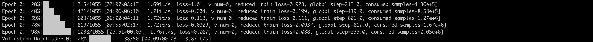
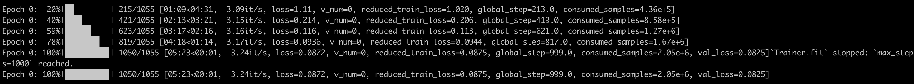

# Nemo Megatron (NeMo) on the MosaicML platform

[The MosaicML platform](https://www.mosaicml.com/blog/mosaicml-cloud-demo) enables easy training of machine learning (ML) jobs. In this folder, we provide examples for how to run NVIDIA Nemo Megatron (NeMo), a powerful conversational AI toolkit that helps researchers from industry and academia reuse prior work and readily scales up to 1000s of GPUs, on the MosaicML platform.

You’ll find in this folder:

-   `single_node.yaml` - a script to run a single node GPT NeMo training job on the MosaicML platform.
-   `multi_node.yaml` - a script to run a multi-node GPT NeMo training job on the MosaicML platform.

## Prerequisites

Here’s what you’ll need to get started with running NeMo on the MosaicML platform

-   A docker image with the correctly installed NeMo dependencies (we recommend using `nvcr.io/nvidia/nemo:22.09`).
-   [A dataset prepared in the expected format](https://docs.nvidia.com/deeplearning/nemo/user-guide/docs/en/stable/nlp/nemo_megatron/gpt/gpt_training.html#data-download-pre-processing).

## Starting Training
We include the `.yaml` files required to run NeMo on the MosaicML platform. You just need to fill in the `run_name`, `cluster`, and `your_dataset_path_here` fields in the `.yaml` files. Additionally, other NeMo configs can be modified as usual.

********************************Single Node Jobs********************************

For a single node training job, potentially running on multiple GPUs, it’s as simple as running `mcli run -f single_node.yaml`.

The logs for a successful training job should look something like:

<picture>
  <source media="(prefers-color-scheme: dark)" srcset="./assets/single_node.png">
  
</picture>

************Multi-Node Jobs************

To run a multi-node job it’s as simple as running `mcli run -f multi_node.yaml`.

Fundamentally, the script relies on using the `parallel` library to create the appropriate number of processes, 8, one per GPU. The MosaicML platform sets up the appropriate ENV variables such that NeMo knows the size of the job.

Below are the logs from multi-node training:

<picture>
  <source media="(prefers-color-scheme: dark)" srcset="./assets/multi_node.png">
  
</picture>

Notice we get approximately linear scaling with the number of GPUs running GPT NeMo jobs on the MosaicML platform.
