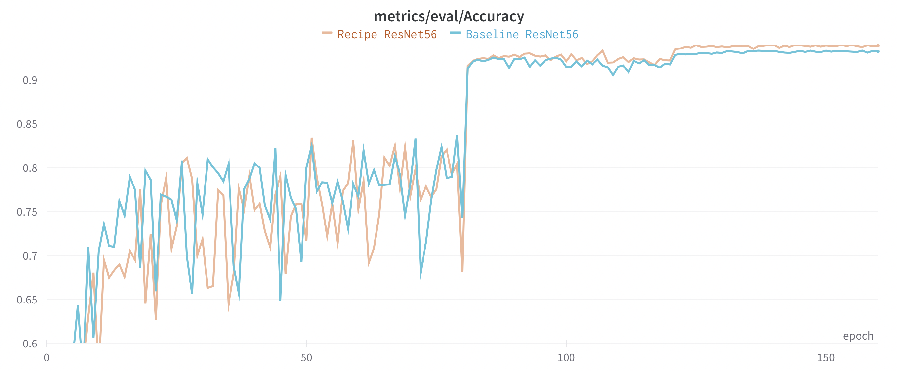

<br />
<p align="center">
  <picture>
    <source media="(prefers-color-scheme: dark)" srcset="./assets/acc_curve_dark.png">
    
  </picture>
</p>

<h2><p align="center">CIFAR10 Benchmark</p></h2>

<h3><p align='center'>
<a href="https://www.mosaicml.com">[Website]</a>
- <a href="https://docs.mosaicml.com/">[Composer Docs]</a>
- <a href="https://docs.mosaicml.com/en/stable/method_cards/methods_overview.html">[Methods]</a>
- <a href="https://www.mosaicml.com/team">[We're Hiring!]</a>
</p></h3>

<p align="center">
    <a href="https://join.slack.com/t/mosaicml-community/shared_invite/zt-w0tiddn9-WGTlRpfjcO9J5jyrMub1dg">
        
    </a>
    <a href="https://github.com/mosaicml/examples/blob/main/LICENSE">
        
    </a>
</p>
<br />

This folder contains starter code for training a CIFAR ResNet architecture. You can swap out the model and dataset if desired, but we recommend using the [ResNet + ImageNet benchmark](../resnet/) for new models and datasets.

## Overview

The files in this folder are:

- `model.py` - Creates a [ComposerModel](https://docs.mosaicml.com/en/stable/composer_model.html) from a CIFAR ResNet model defined in the script
- `data.py` - Creates either a Torchvision dataset or a [MosaicML streaming dataset](https://streaming.docs.mosaicml.com/en/stable/) for CIFAR10
- `main.py` - Trains a CIFAR ResNet on CIFAR10 using the [Composer](https://github.com/mosaicml/composer) [Trainer](https://docs.mosaicml.com/en/stable/api_reference/generated/composer.Trainer.html#trainer)
- `tests/` - A suite of tests to check each training component
- `yamls/`
  - `resnet56.yaml` - Configuration for a CIFAR ResNet56 training run, to be used as the first argument to `main.py`
  - `mcloud_run.yaml` - yaml to use if running on the [MosaicML platform](https://www.mosaicml.com/blog/introducing-mosaicml-cloud)

Now that you've explored the code, let's get training.

## Get started with the MosaicML platform

If you're using the MosaicML platform, all you need to install is [`mcli`](https://github.com/mosaicml/mosaicml-cli/):

```bash
pip install --upgrade mosaicml-cli
mcli init
```

Then, just fill in a few fields in [yamls/mcloud_run.yaml](./yamls/mcloud_run.yaml):

```yaml
cluster: # Add the name of the cluster to use for this run
gpu_type: # Type of GPU to use; usually a100_40gb
integrations:
  - integration_type: git_repo
    git_repo: mosaicml/examples # Replace with your fork to use custom code
    git_branch: main # Replace with your branch to use custom code
    ssh_clone: false # Should be true if using a private repo
```

These tell `mcli` where to get your code and what cluster your organization is using.
If you are using a private github repository, you'll need to set up [github secrets](https://mcli.docs.mosaicml.com/en/latest/secrets/ssh.html#git-ssh-secrets)

With this information provided, you can now run the code in this directory on a remote machine like so:

```bash
mcli run -f yamls/mcloud_run.yaml
```

You're done. You can skip the rest of the instructions except [saving and loading checkpoints](#saving-and-loading-checkpoints).

## Get started without the MosaicML platform

### Prerequisites

If you're not using the MosaicML platform, here's what you need to start training:

- Docker image with PyTorch 1.12+, e.g. [MosaicML's PyTorch image](https://hub.docker.com/r/mosaicml/pytorch/tags)
  - Recommended tag: `mosaicml/pytorch:1.12.1_cu116-python3.9-ubuntu20.04`
  - The image comes pre-configured with the following dependencies:
    - PyTorch Version: 1.12.1
    - CUDA Version: 11.6
    - Python Version: 3.9
    - Ubuntu Version: 20.04
- System with NVIDIA GPUs

### Installation

Just clone this repo and install the requirements. If you want to customize the
code, first fork this repo on GitHub and clone your fork instead.

```bash
git clone https://github.com/mosaicml/examples.git
cd examples
pip install -e ".[resnet-cifar]"  # or pip install -e ".[resnet-cifar-cpu]" if no NVIDIA GPU
cd examples/resnet_cifar
```

### How to start training

Now that you've installed dependencies, let's start training!

**Please remember**: for both `train-dataset` and `eval_dataset`, edit the `path` argument and (if streaming) `local` arguments in `resnet56.yaml` to point to where your data is located (or where you would like the data to be downloaded if `download: true`).

We run the `main.py` script using our `composer` launcher, which generates a process for each device in a node.

For a single node, the `composer` launcher will autodetect the number of devices, so all you need to do is:

```bash
composer main.py yamls/resnet56.yaml
```

### Results

You should see logs printed to your terminal like below. You can also easily enable other experiment trackers like Weights and Biases or CometML using [Composer's logging integrations](https://docs.mosaicml.com/en/stable/trainer/logging.html).

```bash
[epoch=0][batch=16/625]: wall_clock/train: 17.1607
[epoch=0][batch=16/625]: wall_clock/val: 10.9666
[epoch=0][batch=16/625]: wall_clock/total: 28.1273
[epoch=0][batch=16/625]: lr-DecoupledSGDW/group0: 0.0061
[epoch=0][batch=16/625]: trainer/global_step: 16
[epoch=0][batch=16/625]: trainer/batch_idx: 16
[epoch=0][batch=16/625]: memory/alloc_requests: 38424
[epoch=0][batch=16/625]: memory/free_requests: 37690
[epoch=0][batch=16/625]: memory/allocated_mem: 6059054353408
[epoch=0][batch=16/625]: memory/active_mem: 1030876672
[epoch=0][batch=16/625]: memory/inactive_mem: 663622144
[epoch=0][batch=16/625]: memory/reserved_mem: 28137488384
[epoch=0][batch=16/625]: memory/alloc_retries: 3
[epoch=0][batch=16/625]: trainer/grad_accum: 2
[epoch=0][batch=16/625]: loss/train/total: 7.1292
[epoch=0][batch=16/625]: metrics/train/MulticlassAccuracy: 0.0005
[epoch=0][batch=17/625]: wall_clock/train: 17.8836
[epoch=0][batch=17/625]: wall_clock/val: 10.9666
[epoch=0][batch=17/625]: wall_clock/total: 28.8502
[epoch=0][batch=17/625]: lr-DecoupledSGDW/group0: 0.0066
[epoch=0][batch=17/625]: trainer/global_step: 17
[epoch=0][batch=17/625]: trainer/batch_idx: 17
[epoch=0][batch=17/625]: memory/alloc_requests: 40239
[epoch=0][batch=17/625]: memory/free_requests: 39497
[epoch=0][batch=17/625]: memory/allocated_mem: 6278452575744
[epoch=0][batch=17/625]: memory/active_mem: 1030880768
[epoch=0][batch=17/625]: memory/inactive_mem: 663618048
[epoch=0][batch=17/625]: memory/reserved_mem: 28137488384
[epoch=0][batch=17/625]: memory/alloc_retries: 3
[epoch=0][batch=17/625]: trainer/grad_accum: 2
[epoch=0][batch=17/625]: loss/train/total: 7.1243
[epoch=0][batch=17/625]: metrics/train/MulticlassAccuracy: 0.0010
train          Epoch   0:    3%|▋                        | 17/625 [00:17<07:23,  1.37ba/s, loss/train/total=7.1292]
```

## Saving and Loading checkpoints

At the bottom of `yamls/resnet56.yaml`, we provide arguments for saving and loading model weights. Please specify the `save_folder` or `load_path` arguments if you need to save or load checkpoints!

## Contact Us

If you run into any problems with the code, please file Github issues directly to this repo.
