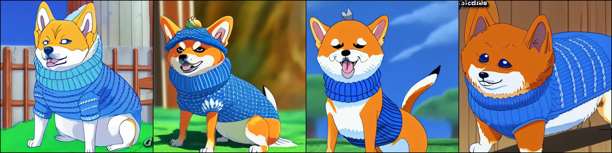
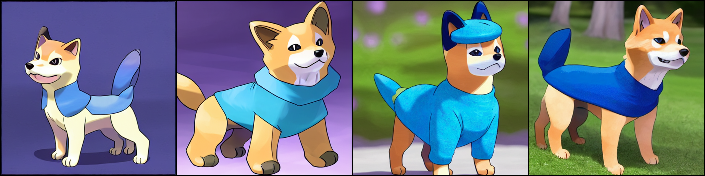

<p align="center">
  <picture>
    
  </picture>
</p>

<h2><p align="center">Stable Diffusion Finetuning</p></h2>

<h3><p align='center'>
<a href="https://www.mosaicml.com">[Website]</a>
- <a href="https://docs.mosaicml.com/">[Composer Docs]</a>
- <a href="https://docs.mosaicml.com/en/stable/method_cards/methods_overview.html">[Methods]</a>
- <a href="https://www.mosaicml.com/team">[We're Hiring!]</a>
</p></h3>

<p align="center">
    <a href="https://join.slack.com/t/mosaicml-community/shared_invite/zt-w0tiddn9-WGTlRpfjcO9J5jyrMub1dg">
        
    </a>
    <a href="https://github.com/mosaicml/examples/blob/main/LICENSE">
        
    </a>
</p>
<br />

This folder contains starter code for finetuning Stable Diffusion. You can easily finetune Stable Diffusion v1 or v2 on any available image-caption HuggingFace dataset, save the model, and generate your own images. Optionally, you can create your own dataset to adapt Stable Diffusion to your desired domain.


# Quick Start

## Clone the repo and install requirements

```bash
git clone https://github.com/mosaicml/examples.git
cd examples
pip install -e ".[stable-diffusion]"
cd examples/stable_diffusion
```

## Train the model
```
composer main.py yamls/finetune.yaml
```

# Results
The default config is `yamls/finetune.yaml`. It trains only the Unet portion of `Stable Diffusion v1-4` for `2000 batches` on the lambda labs `Pokemon` dataset. A default set of evaluation prompts are included in the yaml and will be logged to weights & baises every `200 batches`.

Results from the default config and the prompt  `"a majestic shiba inu doge wearing a blue sweater"`:
<p align="center">
  <picture>
    
  </picture>
</p>

Note: Low learning rates and short training times seem to work best. Training longer can quickly lead to overfitting.


# To train on different data
The easiest way to train with new data is to make a new dataset in the same format as the `lambdalabs/pokemon` dataset. The `lambdalabs/pokemon` dataset was made with BLIP (a salesforce image captioning model) and uploaded to HuggingFace datasets. There are many other similar text-to-image datasets available on HuggingFace [here](https://huggingface.co/datasets?task_categories=task_categories:text-to-image). Any of the text-to-image datasets with `image` and `text` columns can be used by simply changing the dataset name in `yamls/finetune.yaml`. Datasets with different formats or color palettes such as spectrograms may require different normalization or pre-processing.

To add a non-HuggingFace dataset, create your own dataset that yeilds `image` and `text` pairs and use the `build_hf_image_caption_datapsec` function in `data.py` for guidance regarding tokenization and transformations.

# Using the MosaicML platform
This example can be run with the MosaicML platform by configuring the `cluster` and `gpu_type` parameters in `yamls/mcloud_run.yaml` then running:

```bash
mcli run -f yamls/mcloud_run.yaml
```

# Saving and Loading checkpoints

At the bottom of `yamls/finetune.yaml`, we provide arguments for saving and loading model weights. Please specify the `save_folder` or `load_path` arguments if you need to save or load checkpoints!

# Contact Us
If you run into any problems with the code, please file Github issues directly to this repo.
