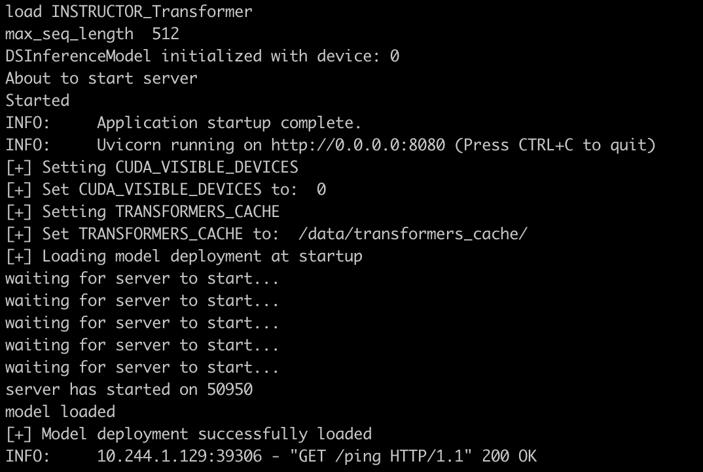

# Inference with Custom Models on the MosaicML platform

In this folder, we provide an example of how to create and deploy your own model using MosaicML Inference.

You'll find in this folder:

- `hf_instructor_model_class.py` - a custom model class that implements the Hugging Face model [instructor-large](https://huggingface.co/hkunlp/instructor-large)
- `custom_mosaic_gpt.yaml` - a script to deploy the model on the MosaicML platform

## Prerequisites

The only thing you need to deploy this model is access to MosaicML's inference service. [Contact us to get started](https://forms.mosaicml.com/demo).

## Configuring the Model

Currently, we offer support for any hugging face model and custom models that follow a model class spec. The provided `.yaml` file is configured to deploy the custom instructor model class. Information on the configuration options can be found [here](https://docs.mosaicml.com/projects/mcli/en/latest/main_concepts/inference_schema.html).

# Deploying the Model

Deploying the model is as simple as running `mcli deploy -f yamls/instructor_model.yaml`.

The logs for a successful deployment should look something like:

<picture>
  <source media="(prefers-color-scheme: dark)" srcset="./assets/instructor_model_logs.png">
  
</picture>

# Running Inference

Once the model has successfully been deployed, we can run inference by running `mcli predict <deployment_name> --inputs <input_dictionary>`.
