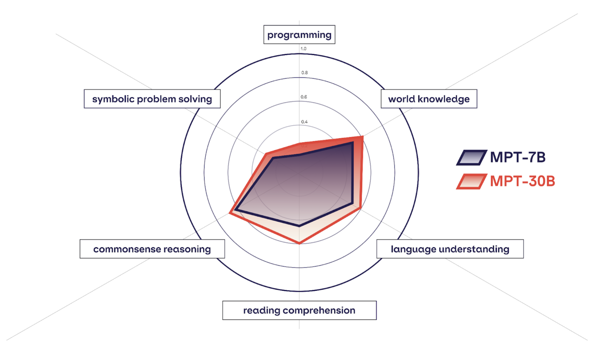

# Mosaic Eval Gauntlet v0.1.0 - Evaluation Suite

<!-- SETUPTOOLS_LONG_DESCRIPTION_HIDE_BEGIN -->

    <picture>
      
    </picture>
     
    MPT-7B vs MPT-30B compared on the 6 categories of Eval Gauntlet v0.

The Mosaic Eval Gauntlet is MosaicML’s new technique for evaluating the quality of pretrained foundation models. The Eval Gauntlet encompasses 35 different benchmarks collected from a variety of sources, and organized into 6 broad categories of competency that we expect good foundation models to have. We compiled the categories after an extensive review of existing LLM publications, and open source evaluation harnesses such as EleutherAI Eval Harness and Stanford CRFM’s HELM.

 
While deciding which benchmarks to include, we had a few criteria in mind. We wanted benchmarks to require a broad range of skills that were useful for practical applications, we wanted them to come from a diverse range of sources, we wanted them to capture skills that have been traditionally emphasized by the research community as well as those that have been underexplored, and we wanted them to be evaluated via simple, unambiguous metrics such as exact match and multiple choice accuracy. The philosophy behind compiling aggregate scores as opposed to the more common approach of reporting individual metrics, is two-fold.

1. LLMs are the first generation of true generalist models. They are sought after because they can do tens of thousands of different tasks well with only a little bit of prompting. This capacity cannot be adequately captured with only 10 different academic benchmarks. It wouldn't be possible to define and evaluate every conceivable task an LLM could be used for, but with Composer's blazing fast ICL evaluation, it is certainly worth a shot!

2. Using a small set of metrics can be produce misleadingly high variance. This can lead us into thinking models' abilities are starkly different, even when a few minutes of interacting with the models will reveal that they feel pretty similar. By aggregating scores across dozens of benchmarks, we can reduce the signal-to-noise ratio and get more robust estimates of models' relative performance.

Furthermore, we made the unique design decision to report multiple separate aggregate scores organized by category, rather than a single monolithic metric. This is because end users frequently want to deploy models for specific use-cases. There are many design decisions that go into training a model for a specific vertical, including dataset mixture. By decomposing model performance into a manageable set of core competencies, we can make more intelligent design decisions during the model training process.

At evaluation time, we run all the benchmarks, average the subscores within each category, and report the composite score for each category as well as the average of the composite scores. Some benchmarks are multiple choice examinations, for which it is possible to get above 0% accuracy with just random guessing. In order to ensure that all our composite scores are less than or equal to 1, we subtract the random baseline accuracy and rescale the remainder by 1 minus the baseline accuracy.

For example, if benchmark A has a random baseline accuracy of 25%, and the model achieved 30%, we would report this as (0.3 - 0.25)/(1-0.25) = 0.0667. This can be thought of as the accuracy above chance rescaled so the max is 1. For benchmarks in which the random guessing baseline accuracy is ~0 we report the accuracy as is. Note that with this rescaling, a model could technically score below 0 on a category as a whole, but we haven’t found this to occur with any of the models we’ve tested.

This is version v0.1.0 of the Eval Gauntlet.

### Reading Comprehension

Reading comprehension benchmarks test a model’s ability to answer questions based on the information in a passage of text. It includes a number of multiple choice benchmarks as well as some benchmarks that require the model to output an exact correct answer.

1. SQuAD
   - Description: SQuAD consists of 10,570 short documents followed by a related question. The documents range from short news clippings about sports events, to blurbs explaining concepts in physics, to documents about US history. We expect the model to output the exact correct answer.
   - Year released: 2016
   - Number of few shot examples: 3
   - Random baseline accuracy: ~0%

3. BoolQ
   - Description: BoolQ consists of 3,270 short passages on a diverse range of subjects followed by a yes/no questions. The model is expected to answer in multiple-choice format.
   - Year released: 2019
   - Number of few shot examples: 0
   - Random baseline accuracy: ~50%

4. CoQA
   - Description: CoQA consists of 7,983 passage-based short free response questions. For each passage there is a series of related questions. Each question is formatted with the document as well as all the preceding questions/answers provided in context. The model is evaluated using exact match accuracy.
   - Year released: 2018
   - Number of few shot examples: 0
   - Random baseline accuracy: 0%

5. AGI Eval LSAT Reading Comprehension
   - Description: LSAT Reading Comprehension consists of 268 passage-based four choice multiple choice questions focused on a variety of information-focused domains like politics, business, economics, and science. The questions rely on the models ability to extract basic info from the texts.
   - Year released: 2023
   - Number of few shot examples: 5
   - Random baseline accuracy: 25%

6. AGI Eval LSAT Logical Reasoning
   - Description: LSAT Logical Reasoning consists of 510 passage-based four choice multiple choice questions in which the model must draw complex conclusions from passages on a diverse range of subjects.
   - Year released: 2023
   - Number of few shot examples: 5
   - Random baseline accuracy: 25%

7. AGI Eval SAT English
   - Description: SAT English consists of 206 passage-based four choice multiple choice questions in which the model must comprehend highschool level passages.
   - Year released: 2023
   - Number of few shot examples: 5
   - Random baseline accuracy: 25%

### Commonsense Reasoning

Commonsense reasoning tests the models’ ability to perform basic reasoning tasks that require commonsense knowledge of objects, their properties, and their behavior.

8. BIG-bench: Strategy QA
   - Description: BIG-bench strategy QA consists of 2,289 very eclectic yes/no questions on a wide range of commonsense subjects, e.g “Can fish get Tonsilitis?”
   - Year released: 2022
   - Number of few shot examples: 0

9. BIG-bench: Strange Stories
   - Description: BIG-bench strange stories consists of 174 short stories followed by a two-choice multiply choice question in which the model is asked to make commonsense inferences about the characters in the stories, how they might feel, and why they act in certain ways.
   - Year released: 2022
   - Number of few shot examples: 0
   - Random baseline accuracy: 50%

10. COPA
   - Description: COPA consists of 100 cause/effect multiple choice questions in which the model is prompted with a premise and the model must choose correctly between two possible causes/effects of the premise.
   - Year released: 2011
   - Number of few shot examples: 0
   - Random baseline accuracy: 50%

11. PIQA
    - Description: PIQA consists of 1,838 commonsense physical intuition 2-choice multiple choice questions.
    - Year released: 2019
    - Number of few shot examples: 10
    - Random baseline accuracy: 50%

14. OpenBook QA
    - Description: OpenBook QA consists of 500 four-choice multiple choice questions that rely on basic physical and scientific intuition about common objects and entities.
    - Year released: 2018
    - Number of few shot examples: 10
    - Random baseline accuracy: 25%

15. SIQA
    - Description: Social Interaction QA consists of 1954 two-choice multiple choice questions that test a model's ability to draw emotional and social conclusions about the participants in everyday situations.
    - Year released: 2019
    - Number of few shot examples: 3
    - Random baseline accuracy: 50%

16. Commonsense QA
    - Description: Commonsense QA consists of 1,221 four-choice multiple choice questions that rely on very basic commonsense reasoning about everyday items.
    - Year released: 2019
    - Number of few shot examples: 0
    - Random baseline accuracy: 25%

### World knowledge

17. Jeopardy
    - Description: Jeopardy consists of 2,117 Jeopardy questions separated into 5 categories: Literature, American History, World History, Word Origins, and Science. The model is expected to give the exact correct response to the question. It was custom curated by MosaicML from a larger Jeopardy set available on [Huggingface](https://huggingface.co/datasets/jeopardy).
    - Year released: 2022
    - Number of few shot examples: 3
    - Random baseline accuracy: 0%

18. MMLU
    - Description: MMLU consists of 14,042 four-choice multiple choice questions distributed across 57 categories. The questions are in the style of academic standardized tests and the model is provided the question and the choices and is expected to choose between A, B, C, and D as its outputs. The subjects range from jurisprudence, to math, to morality.
    - Year released: 2019
    - Number of few shot examples: 5
    - Random baseline accuracy: 25%

19. BIG-bench: wikidata
    - Description: BIG-bench wikidata consists of 20,321 questions regarding factual information pulled from wikipedia. Questions range from the native language of celebrities to the country that different regions belong to. Models are given a sentence such as “The country of citizenship of Barack Obama is” and are expected to complete the sentence with e.g. “the United States.”
    - Year released: 2022
    - Number of few shot examples: 3
    - Random baseline accuracy: ~0%

20. ARC easy
    - Description: ARC easy consists of 2,376 easy four-choice multiple choice science questions drawn from grade 3-9 science exams. The questions rely on world knowledge related to basic science.
    - Year released: 2019
    - Number of few shot examples: 3
    - Random baseline accuracy: 25%

21. ARC challenge
    - Description: ARC easy consists of 2,376 easy four-choice multiple choice science questions drawn from grade 3-9 science exams. The questions rely on scientific world knowledge and some procedural reasoning.
    - Year released: 2019
    - Number of few shot examples: 3
    - Random baseline accuracy: 25%

22. Trivia QA - modified
    - Description: Trivia QA is a question answering dataset that assesses the model's ability to produce free-response short answers to trivia questions. We've subsampled it to contain 3,000 questions and we've clipped all answers to be at most 10 tokens long in order to improve speed.
    - Year released: 2017
    - Number of few shot examples: 3
    - Random baseline accuracy: 0%

### Symbolic problem solving

Symbolic problem solving tasks test the model’s ability to solve a diverse range of symbolic tasks including arithmetic, logical reasoning, algorithms, and algebra.

23. BIG-bench elementary math QA
    - Description: Big bench elementary math QA consists of 38,160 four-choice multiple choice arithmetic word problems.
    - Year released: 2022
    - Number of few shot examples: 1
    - Random baseline accuracy: 25%

25. BIG-bench dyck languages
    - Description: Big bench dyck languages consists of 1000 complete-the-sequence questions, in which a partially completed balanced expression consisting of parentheses and braces is given, and the model needs to output the exact tokens necessary in order to complete the balanced expression.
    - Year released: 2022
    - Number of few shot examples: 5
    - Random baseline accuracy: 0%

26. BIG-bench operators
    - Description: Big bench logical operators consists of 210 questions, in which a number of mathematical operators are defined and the model is expected to calculate the result of some expression consisting of those defined operators. This tests the model’s ability to handle mathematical abstractions and apply them appropriately.
    - Year released: 2022
    - Number of few shot examples: 3
    - Random baseline accuracy: 0%

27. Simple arithmetic with spaces
    - Description: Simple arithmetic with spaces was developed by MosaicML. It consists of 1000 arithmetic problems consisting of up to 3 operations and using numbers of up to 3 digits. There is spacing between all numbers and operators. The model is expected to calculate the correct result of the expression using the appropriate order of operations.
    - Year released: 2023
    - Number of few shot examples: 5
    - Random baseline accuracy: 0%

28. Simple arithmetic without spaces
    - Description: Simple arithmetic with spaces was developed by MosaicML. It consists of 1000 arithmetic problems consisting of up to 3 operations and using numbers of up to 3 digits. There is no spacing between any of the numbers and operators. The model is expected to calculate the correct result of the expression using the appropriate order of operations.
    - Year released: 2023
    - Number of few shot examples: 5
    - Random baseline accuracy: 0%

29. AGI Eval LSAT Analytical Reasoning
    - Description: AGI Eval LSAT Analytical Reasoning consists of 230 four-choice multiple choice logic puzzles. The questions are taken from the AGI Eval benchmark.
    - Year released: 2023
    - Number of few shot examples: 3
    - Random baseline accuracy: 25%

30. GSM8K
    - Description: GSM8K consists of 1,319 short, free-response grade school-level arithmetic word problems with simple numerical solutions. The model is prompted to use chain-of-thought reasoning before giving a final answer.
    - Year released: 2023
    - Number of few shot examples: 3
    - Random baseline accuracy: 0%

31. SVAMP
    - Description: SVAMP consists of 300 short, free-response grade school-level arithmetic word problems with simple numerical solutions. The model is prompted to use chain-of-thought reasoning before giving a final answer.
    - Year released: 2023
    - Number of few shot examples: 3
    - Random baseline accuracy: 0%

### Language understanding

Language understanding tasks evaluate the model’s ability to understand the structure and properties of languages, including determining which types of sentences are more likely than others, performing translations between languages, and identifying languages.

32. LAMBADA
    - Description: LAMBADA consists of 5,153 passages take from books. The model is expected to read the first N-1 words of each passage and predict the final token.
    - Year released: 2016
    - Number of few shot examples: 0
    - Random baseline accuracy: 0%

33. HellaSwag
    - Description: HellaSwag consists of 10,042 multiple choice scenarios in which the model is prompted with a scenario and choose the most likely conclusion to the scenario from four possible options.
    - Year released: 2019
    - Number of few shot examples: 0
    - Random baseline accuracy: 25%

34. Winograd Schema Challenge
    - Description: The Winograd Schema Challenge consists of 273 scenarios in which the model must use semantics to correctly resolve the anaphora in a sentence. Two possible beginnings to a sentence are presented as well as an ending. Both involve some anaphora being resolved in a different way, only one of which would be semantically valid, and the model must choose which option produces the valid resolution.
    - Year released: 2012
    - Number of few shot examples: 3
    - Random baseline accuracy: 50%

35. Winogrande
    - Description: The Winogrande consists of 1,267 scenarios in which two possible beginnings of a sentence are presented along with a single ending. Both combinations are syntactically valid, but only one is semantically valid, and the model must choose the one that is semantically valid.
    - Year released: 2012
    - Number of few shot examples: 5
    - Random baseline accuracy: 50%

### Programming
Programming tasks evaluate the model's ability to understand code, write functionally correct code given a specification, simulate code, and document code. Right now we just have HumanEval but later versions will include more. By default the programming tasks are disabled in `scripts/eval/yamls/tasks.yaml` due to their long duration.

36. HumanEval Python code generation
    - Description: HumanEval Python consists of 164 python programming challenges, in which the model is presented with the method signature and docstring comment for a python program and is expected to complete the program. We then test the resultant code’s functional correctness on a number of test input/output pairs.
    - Year released: 2022
    - Number of few shot examples: 0
    - Random baseline accuracy: 0%
37. HumanEval C++ code generation
    - Description: HumanEval C++ consists of 161 C++ programming challenges, in which the model is presented with the method signature and docstring comment for a C++ program and is expected to complete the program. We then test the resultant code’s functional correctness on a number of test input/output pairs. The C++ translation of HumanEval comes from the [CodeGeex](https://huggingface.co/datasets/THUDM/humaneval-x/viewer/cpp) project.
    - Year released: 2022
    - Number of few shot examples: 0
    - Random baseline accuracy: 0%
38. HumanEval JS code generation
    - Description: HumanEval JS consists of 164 Javscript programming challenges, in which the model is presented with the method signature and docstring comment for a Javacript program and is expected to complete the program. We then test the resultant code’s functional correctness on a number of test input/output pairs. The JS translation of HumanEval comes from the [CodeGeex](https://huggingface.co/datasets/THUDM/humaneval-x/viewer/cpp) project.
    - Year released: 2022
    - Number of few shot examples: 0
    - Random baseline accuracy: 0%
54. HumanEval Python 25% code generation
    - Description: HumanEval Python 25% is an easier variant of HumanEval Python in which in addition to the original method signature, the model is also provided 25% of the lines in the canonical solution and expected to complete the reaminder of the program. It consists of 164 samples.
    - Year released: 2023
    - Number of few shot examples: 0
    - Random baseline accuracy: 0%
55. HumanEval Python 50% code generation
    - Description: HumanEval Python 50% is an easier variant of HumanEval Python in which in addition to the original method signature, the model is also provided 50% of the lines in the canonical solution and expected to complete the reaminder of the program. It consists of 164 samples.
    - Year released: 2023
    - Number of few shot examples: 0
    - Random baseline accuracy: 0%
56. HumanEval Python 75% code generation
    - Description: HumanEval Python 75% is an easier variant of HumanEval Python in which in addition to the original method signature, the model is also provided 75% of the lines in the canonical solution and expected to complete the reaminder of the program. It consists of 164 samples.
    - Year released: 2023
    - Number of few shot examples: 0
    - Random baseline accuracy: 0%
57. HumanEval Python simple return statement code generation
    - Description: HumanEval Python simple return statament is an easier variant of HumanEval Python in which the model is provided all of the canonical solution with the exception of the return statement and is expected to complete the return statement. Additionally, this set contains only the problems for which the canonical solution has a "simple" return statement consisting only of a line of the form `return VARIABLE\_NAME`. There are 37 samples.
    - Year released: 2023
    - Number of few shot examples: 0
    - Random baseline accuracy: 0%
58. HumanEval Python complex return statement code generation
    - Description: HumanEval Pythom complex return statament is an easier variant of HumanEval Python in which the model is provided all of the canonical solution with the exception of the return statement and is expected to complete the return statement. Additionally, this set contains only the problems for which the canonical solution does not have a "simple" return statement as defined above. There are 127 samples.
    - Year released: 2023
    - Number of few shot examples: 0
    - Random baseline accuracy: 0%

### Long Context Gauntlet

We've included three different tasks for long (> 4000 tokens) context length evals. They are meant as litmus tests for a model's ability to properly utilize it's longer context length, which is often the result of fine-tuning after pre-training. For some of these datasets, we explicitly create sets where the required information is located in different sections of the input context, either the beginning, middle, or end of the input context.

1. HotPotQAXL
    - Description: (HotPotQA)[https://hotpotqa.github.io/] is originally a dataset of ten documents and a question requiring comprehension of one or more of the supplied documents. The non-related documents are completely unrelated and called "distractor" documents. To extend this to longer context lengths, we randomly sample documents from the full set of documents across the dataset, adding them to the current datapoint until the set of documents and its question fills the current context length. We insert the "gold" document(s) (the document(s) containing the information that answers the question) within the first third, second third, or last third of the context length.
    - Lengths: 2k, 4k, 8k, 16k, 32k, 64k
    - Locations: beginning, middle, end
2. Key Value Pairs (Needle In a Haystack)
    - Description: We construct a `.json` of key value pairs, where both the key and value are random hashes, in the style of (Lost in the Middle)[https://github.com/nelson-liu/lost-in-the-middle]. We ask the model to produce a value given a key from a specific key value pair found int he json. The pair is correspondingly located in the first third, second third, or last third of the json.
    - Lengths: 2k, 4k, 8k, 16k, 32k, 64k
    - Locations: beginning, middle, end
2. WikiQA Numeric
    - Description: (WikiQA Numeric)[https://huggingface.co/datasets/abacusai/WikiQA-Altered_Numeric_QA] is a Wikipedia Question Answering dataset with a focus on questions with numeric answers. We preprocess the data only to easily parse it for our framework.
    - Lengths: 2k, 4k, 8k, 16k
    - Locations: N/A
