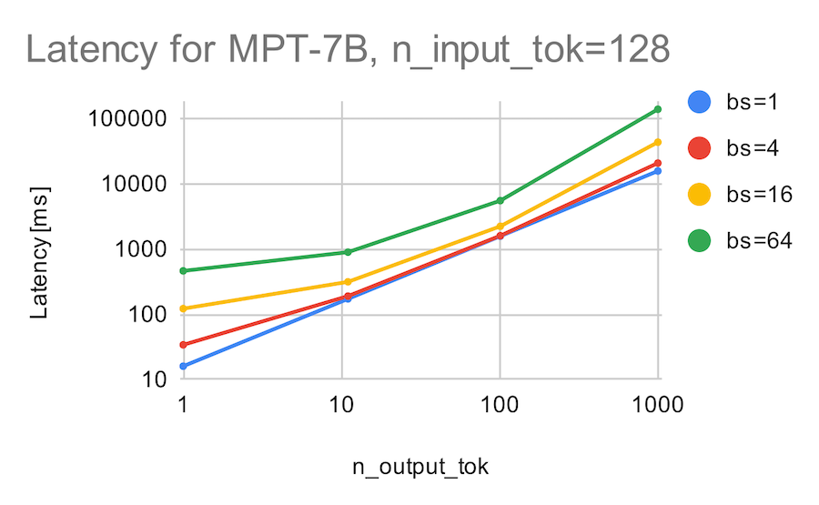
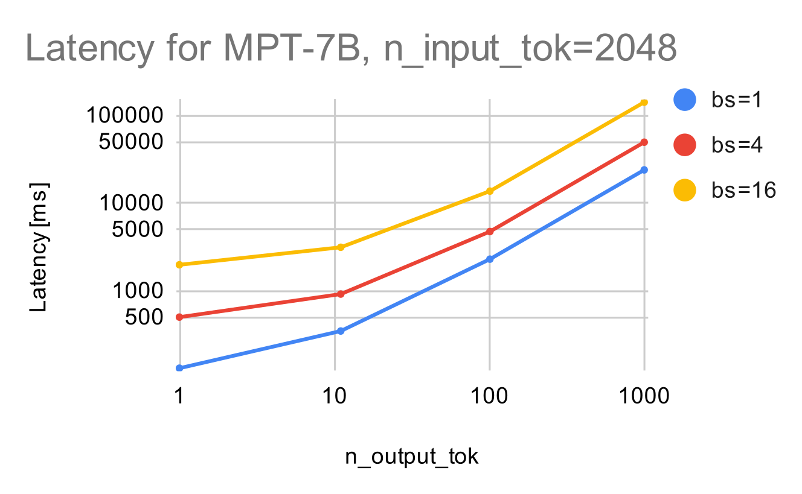
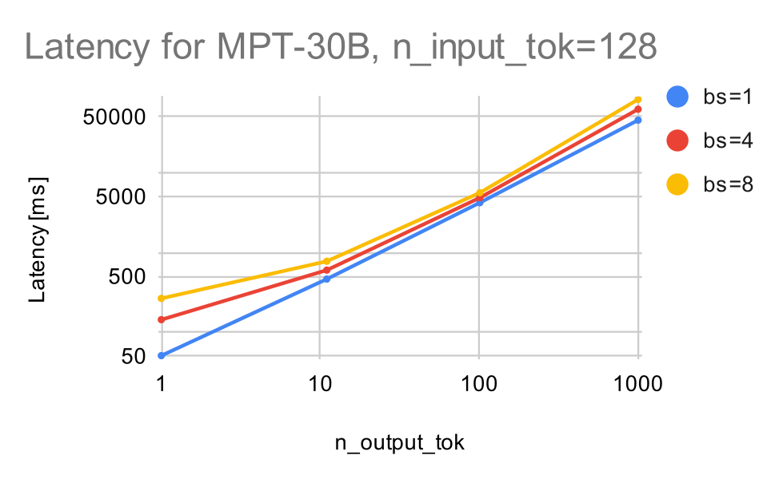
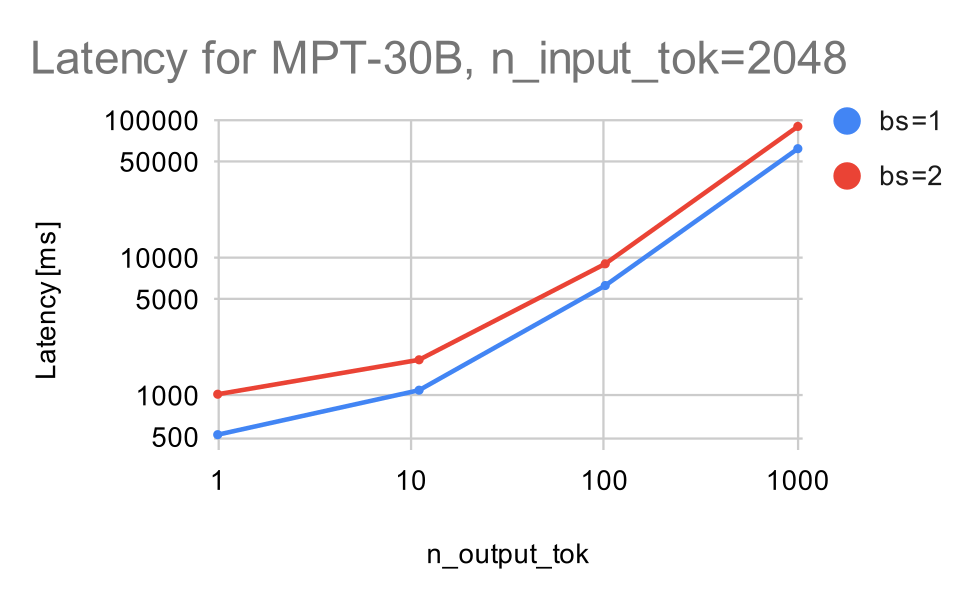

# Inference Benchmarking

This folder provides scripts for benchmarking the inference performance of deep learning models. Currently, we support benchmarking with Deepspeed and Huggingface generate.

## Scripts

The repository includes the benchmark.py script, along with associated `.yaml files,` to run benchmarking. The script takes a `.yaml` file as input and outputs the latency (in seconds) and tokens per second for each run. We average over `num_batches=5`, which is defined in the `.yaml` file. Additionally, we iterate over various `batch_sizes`, `input_lengths`, and `output_lengths` to produce varying throughput metrics.

## Usage

To use the `benchmark.py` script, you need to provide a `.yaml` file that specifies the model configuration and other parameters such as the path to the model checkpoint and the input data. You can modify the default `.yaml` files provided in the repository or create your own `.yaml` file.

To run the benchmarking script, use the following command:

`python benchmark.py yamls/1b.yaml`

To run the scripts on [The MosaicML platform](https://www.mosaicml.com/blog/mosaicml-cloud-demo) we've also included scripts and associated `.yaml files` in the `mcli` folder.

## LLM Inference Overview and Results

### Background

LLM inference consists of two stages: _prefill_ and _decode_. It's important to understand the difference between these stages as latency scales differently in each stage.

During _prefill_, the model processes the input tokens/prompt/context. This is done in a single forward pass, making this stage fast, with excellent use of GPU hardware (ie. high Model Flop Utilization aka [MFU](https://github.com/mosaicml/llm-foundry/tree/main/scripts/train/benchmarking#mfu)). Typically, if people talk about LLM inference being slow, this is _not_ the stage that they are referring to.

During _decode_, the model generates output tokens one at a time, ie. autoregressively. This requires making N forward passes of the model for N tokens. This stage is slow and inefficient, because it requires moving gigabytes of model weights and pre-filled values for every single forward pass. Here, latency scales (mostly) linearly with the number of output tokens. Why mostly linear? When generating long sequences, the overhead from the attention operation becomes visible, which is quadratic.

##### KV cache

One of the important elements of LLM inference is a Key-Value (KV) cache. As part of the prefill stage, the key and value tensors are computed and cached for each token in the prompt across the model layers. This is helpful because the initial prompt does not change during inference, which allows the model layers to simply re-use the cached values, rather than spending compute on re-computing the tokens for the context. \
To set up the KV cache for benchmarking, set `use_cache: true` in the `.yaml` file.

### Results
Now that we have the necessary background to reason about inference, we can move onto the fun stuff, ie. real-world benchmark results.

TODO: we will be releasing the configs used to reproduce these latency results soon!
### I want to run generation with MPT-[X], how long does it take to process different size inputs?

#### Setup
We use a single A100 80GB for inference, running with precision: `bf16` and the `triton` implementation of attention. We include the highest possible batch size that is able to produce 1000 output tokens without running out of GPU memory.

Here we present the latency results over a variety how latency changes for a given input prompt length, while varying batch sizes and the number of output tokens. This should give practitioners a rule of thumb of how inference latency changes across these parameters.
This gives a rule of thumb of how fast you can expect MPT to be based on different generation parameters.
#### Short Inputs (128 input tokens) on MPT-7B

#### Long Inputs (2048 input tokens) on MPT-7B

#### Short Inputs (128 input tokens) on MPT-30B

#### Long Inputs (2048 input tokens) on MPT-30B

Our real-world results match the theory! The latency grows nearly linearly with the number of output tokens, which is the _decode_ stage time. For large batch sizes and output lengths, the latency follows more of a quadratic, which is the attention operation overhead kicking in.

For longer input lengths and batch sizes, the _prefill_ stage starts to become more important, given that the model has to process a lot of input tokens in the forward pass.
Despite the _prefill_ stage being highly efficient, the model still needs to perform a lot of computation in one forward pass, which results in the higher latency when increasing batch size and input length.

### Which hardware system should I use?

While the previous section focused on providing a guideline on how latency changes for different generation parameters, folks who are deploying inference systems often care about satisfying certain latency constraints.
That is to say, there is a certain target latency by which a user _must_ receive the model's output.

Hence, an effective way to compare different inference systems is by plotting their latency vs. throughput, which says how many tokens/second the model can serve given a specific latency constraint.
A model/or setup whose curve is strictly above another's will be able to achieve higher throughput for a given target latency.

To generate these curves, we vary the batch size for a fixed input length (512) and fixed output length (64), and calculate the associated latencies and throughputs.

.png)
.png)

These plots show how using multiple a100s with 40GB and 80GB cards and Tensor Parallelism using `deepspeed` compare with single GPUs.
### Comparing MPT with other open-source models
.png)

Here, we perform a similar benchmark to the previous section, but compare different open-source models amongst each other in doing inference.
The benchmark script supports calling models directly from huggingface (using `hf.generate`), which is done to keep the comparison amongst the models fair. 
The analysis is done on a single A100 80GB GPU, with input length 512, and output length 64, while varying the batch size.

As seen here, both MPT-7B and MPT-30B are among the fastest for inference in the open-source community, with MPT-30B being faster than the respective LLAMA-30B model.
Among the 7B models, LLAMA-7B tends to have higher througput at higher latencies than MPT-7B, though MPT-7B has higher throughput at lower latencies.
We found that Falcon-7B had lower throughput than other open-source models.